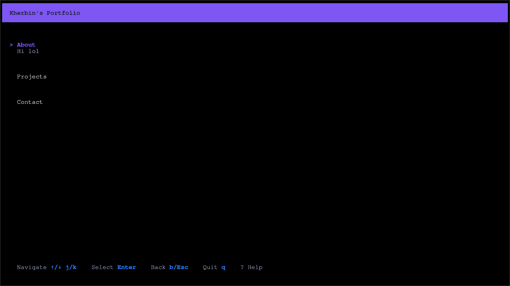
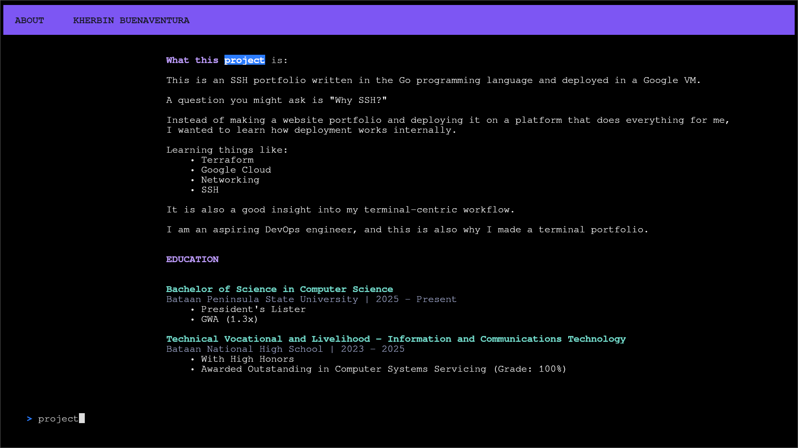
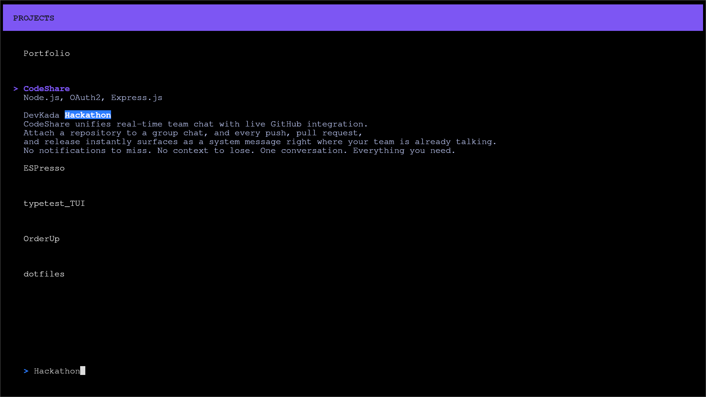
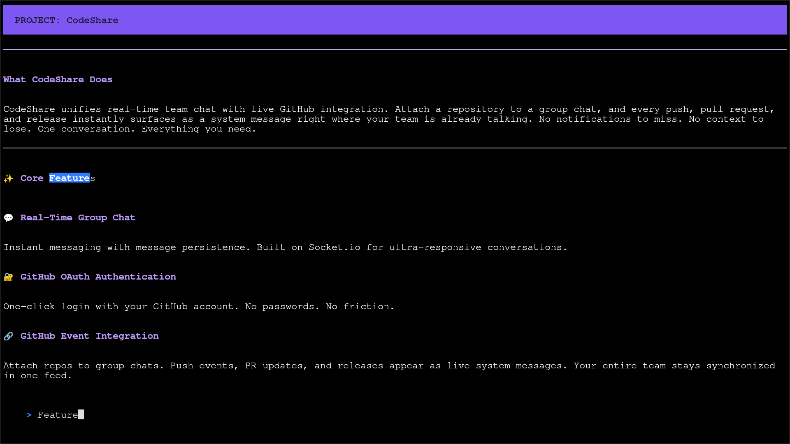
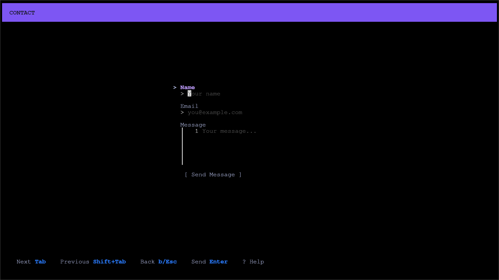
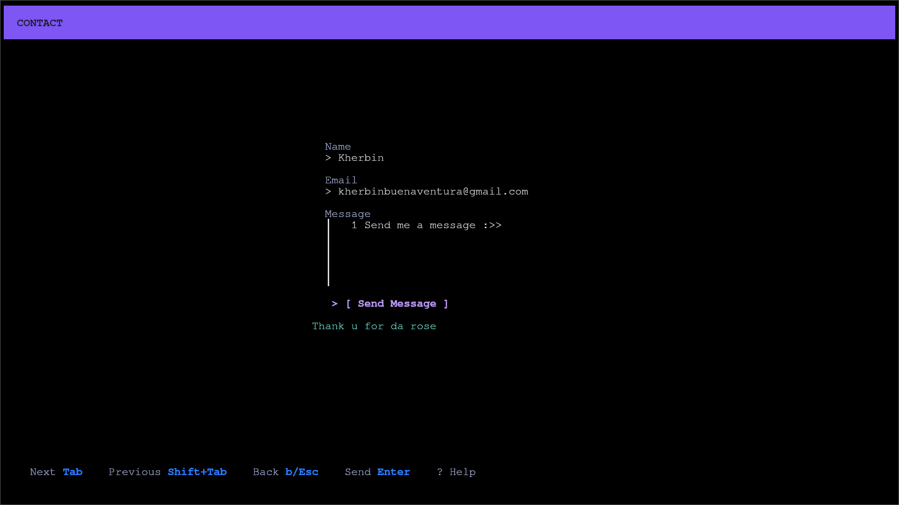
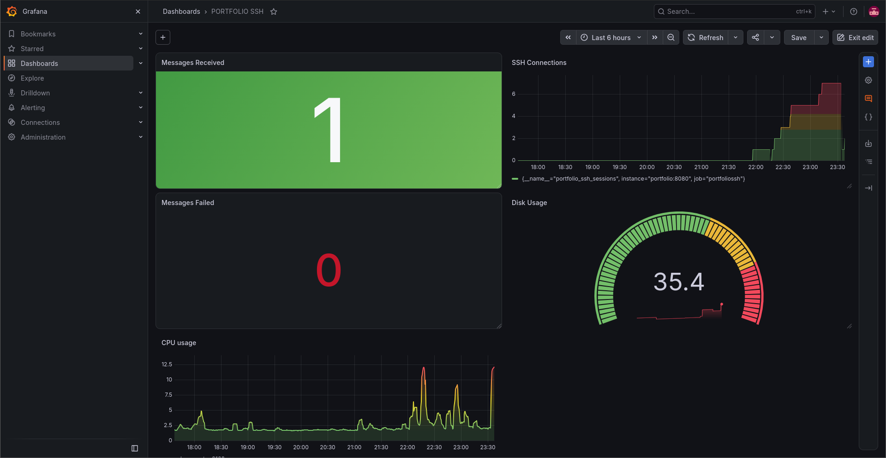

# PortfolioSSH

An overengineered portfolio you visit over **SSH** instead of a browser.

```bash
ssh kherbin.getclingy.download
```

## Demo

https://github.com/user-attachments/assets/4b6385e0-600b-4f6c-8339-cf91a182c6fb

## Screenshots

| Menu | About |
|:---:|:---:|
|  |  |

| Projects | Project README |
|:---:|:---:|
|  |  |

| Contact | Message |
|:---:|:---:|
|  |  |

| Grafana Metrics |
|:---:|
| |

## How it works

1. **SSH server** — A [Wish](https://github.com/charmbracelet/wish) server listens on port `42069` (configurable via `SSH_ADDRESS`). It uses the host key mounted at `SSH_HOST_KEY` (auto-generated by `charmbracelet/keygen` if missing).
2. **Session → TUI** — Every incoming SSH session is handed to a [Bubbletea](https://github.com/charmbracelet/bubbletea) program through the `wish/bubbletea` middleware, running in alt-screen mode. No shell access is ever granted — visitors only get the UI.
3. **Screens** — The TUI has five screens rendered with [Lipgloss](https://github.com/charmbracelet/lipgloss) in forced TrueColor: **Menu → About / Projects / Contact**, plus a **README** view per project.
4. **Live READMEs** — Each project lists a GitHub repo URL. On startup (and re-polled every 5 minutes by a background goroutine), the raw `README.md` of every repo is fetched from `raw.githubusercontent.com`. The markdown is parsed with [Goldmark](https://github.com/yuin/goldmark) (GFM extensions) and converted into styled TUI lines — headings, paragraphs, lists, code blocks, tables, and horizontal rules all render natively in the terminal.
5. **Search** — Vim-style search on content screens: press `/` to type a query, `n`/`N` to jump between matches, with matches highlighted live as you type.
6. **Visitor messaging** — The Contact screen doubles as a message form (name, email, message). Submissions are rate-limited per client IP (in-memory, 5-minute window), persisted to a SQLite database, and fire a Telegram notification — messages reach me without ever exposing an inbox.
7. **Metrics** — Each new session increments a Prometheus counter (`portfolio_ssh_sessions`), exposed on `:8080/metrics`.

### Controls

| Key | Action |
|---|---|
| `↑/↓` or `j/k` | Navigate / scroll |
| `Enter` | Select (menu item / project) |
| `Ctrl+D` / `Ctrl+U` | Half-page scroll down / up |
| `/` | Search (then `n` / `N` for next / previous match) |
| `?` | Toggle help footer |
| `b` / `Esc` | Back |
| `q` | Quit / disconnect |

## Project structure

```
PortfolioSSH/
├── cmd/portfolio/                # Entrypoint — env loading, wiring, background jobs
├── internal/
│   ├── ssh/                      # Wish SSH server, session → Bubbletea middleware
│   ├── ui/                       # Bubbletea model + the five screens
│   │   ├── model.go              #   root model & state machine
│   │   ├── menu_view.go          #   main menu
│   │   ├── about_view.go         #   about screen
│   │   ├── project_view.go       #   project list
│   │   ├── readme_view.go        #   live-rendered project README
│   │   ├── contact_view.go       #   contact + message form
│   │   ├── input.go              #   text-input handling
│   │   ├── search.go             #   vim-style search
│   │   ├── github_fetch.go       #   README polling (every 5 min)
│   │   └── styles.go / layout.go #   Lipgloss styling & layout
│   ├── database/                 # SQLite message store (WAL mode)
│   ├── notifier/                 # Telegram notification on new messages
│   ├── ratelimiter/              # In-memory per-IP rate limiting
│   └── metrics/                  # Prometheus counter + /metrics endpoint
├── docs/screenshots/             # Screenshots used in this README
├── monitoring/prometheus/        # Prometheus scrape config
├── nginx/                        # Nginx reverse proxy (Grafana on :80)
├── terraform/                    # GCP infra — e2-micro VM, firewall
├── .github/workflows/            # CI/CD — build → GHCR → SSH deploy
├── Dockerfile                    # Multi-stage build (Go → Alpine, non-root)
├── docker-compose.yaml           # Production stack (5 services)
└── docker-local.yaml             # Local dev stack
```

## Technology used

| Layer | Technology |
|---|---|
| Language | Go 1.27 |
| TUI framework | Bubbletea, Bubbles, Lipgloss (Charm stack) |
| SSH server | Wish + charmbracelet/ssh |
| Markdown parsing | Goldmark (GitHub Flavored Markdown) |
| Database | SQLite (`modernc.org/sqlite`, pure Go, WAL mode) |
| Notifications | Telegram Bot API |
| Metrics | Prometheus `client_golang` |
| Containerization | Docker — multi-stage build (Go builder → Alpine runtime), non-root user |
| Orchestration | Docker Compose |
| CI/CD | GitHub Actions → GitHub Container Registry → SSH deploy |
| Infrastructure | Terraform + Google Cloud Platform (e2-micro VM, Debian 12) |
| Monitoring | Prometheus, Grafana, Node Exporter |
| Reverse proxy | Nginx (proxies Grafana on port 80) |

## Deployment

1. **Provisioning** — Terraform creates the GCP compute instance (`e2-micro`, Debian 12) in `us-west1-a`.
2. **CI/CD** — Every push to `main` triggers a GitHub Actions workflow that:
   - builds the Docker image tagged with the commit SHA,
   - pushes it to `ghcr.io/codekheb/portfoliossh`,
   - SSHes into the VM and runs `docker compose pull && docker compose up -d` with `IMAGE_TAG` set to that SHA.
3. **Runtime stack** — The production `docker-compose.yaml` runs five services on a private Docker network:
   - `portfolio` — the SSH app (public ports `22` and `42069`, both mapping to the container's `42069`); messages persisted in the `portfolio-data` volume
   - `prometheus` — scrapes the app's metrics (`portfolio:8080`) and node metrics every 15s
   - `grafana` — dashboards over the scraped data
   - `node-exporter` — host-level metrics (root filesystem mounted read-only)
   - `nginx` — the only other public port (`80`), reverse-proxying to Grafana

## Configuration

| Environment variable | Used by | Purpose | Default |
|---|---|---|---|
| `SSH_ADDRESS` | App | Listen address of the SSH server | `:42069` |
| `SSH_HOST_KEY` | App | Path to the SSH host key | `./.docker-data/host_key` |
| `DATABASE_PATH` | App | Path to the SQLite messages database | `./messages.db` |
| `TELEGRAM_BOT_TOKEN` | App | Bot token for message notifications | — (optional) |
| `TELEGRAM_CHAT_ID` | App | Chat ID to notify on new messages | — (optional) |
| `IMAGE_TAG` | Compose | Image tag to pull (`GHCR` + commit SHA) | — |
| `PUBLIC_IP` | Compose | Grafana root URL / domain | — |

A local `.env` file is loaded automatically (godotenv) — handy for the Telegram variables during development.

## Run locally

```bash
docker compose -f docker-local.yaml up --build
```

Then connect from another terminal:

```bash
ssh localhost -p 42069
```

The local variant also exposes the monitoring stack directly: Grafana on `:3000`, Prometheus on `:9090`, and the app's metrics endpoint on `:8080`.

Messages submitted via the Contact screen are stored in SQLite. Telegram notifications are optional — set `TELEGRAM_BOT_TOKEN` and `TELEGRAM_CHAT_ID` in a `.env` file to enable them.

## Metrics

| Metric | Type | Description |
|---|---|---|
| `portfolio_ssh_sessions` | Counter | Total number of SSH sessions served |
| `portfolio_messages_received` | Counter | Total number of succesful messages received |
| `portfolio_messages_failed` | Counter | Total number of messages failed |
